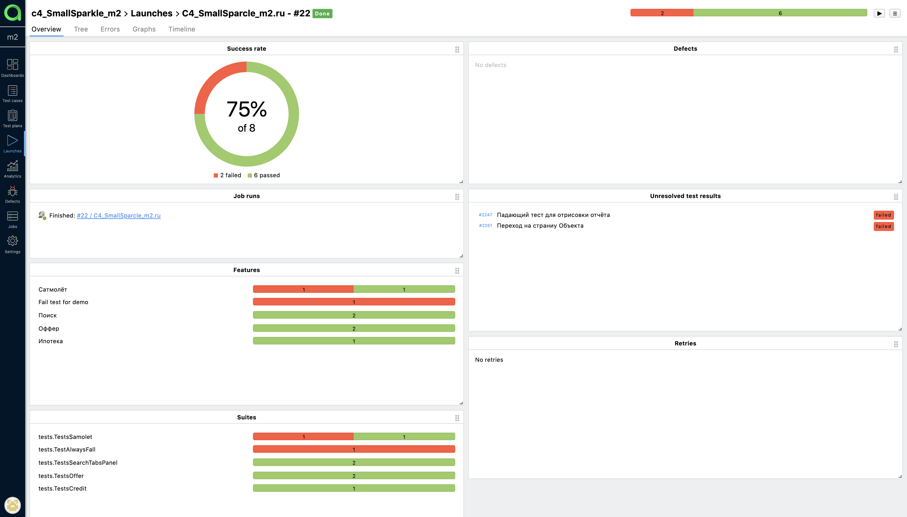
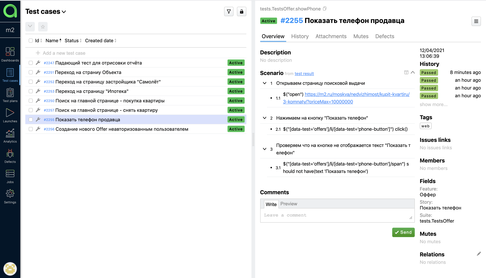
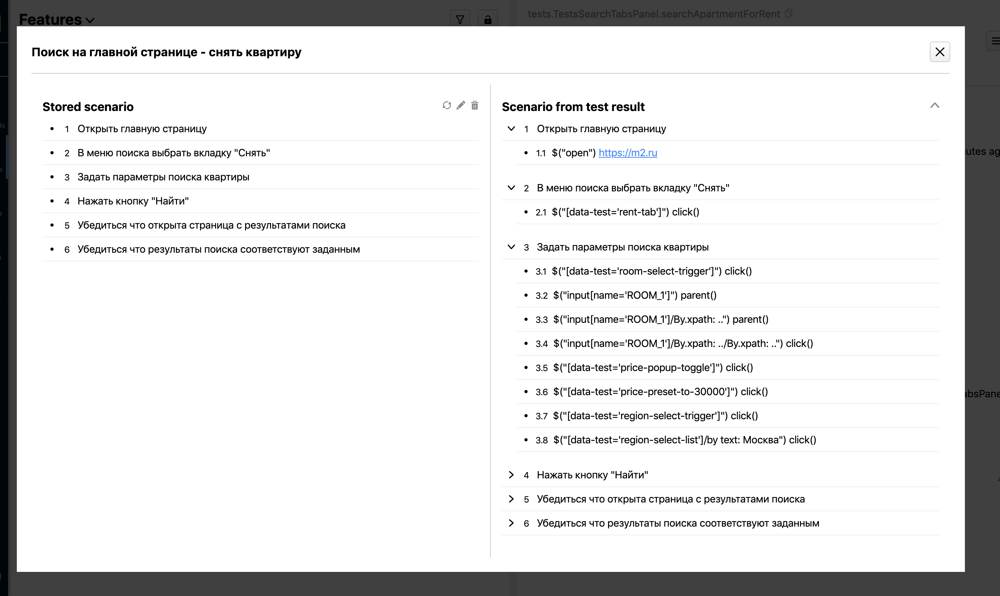
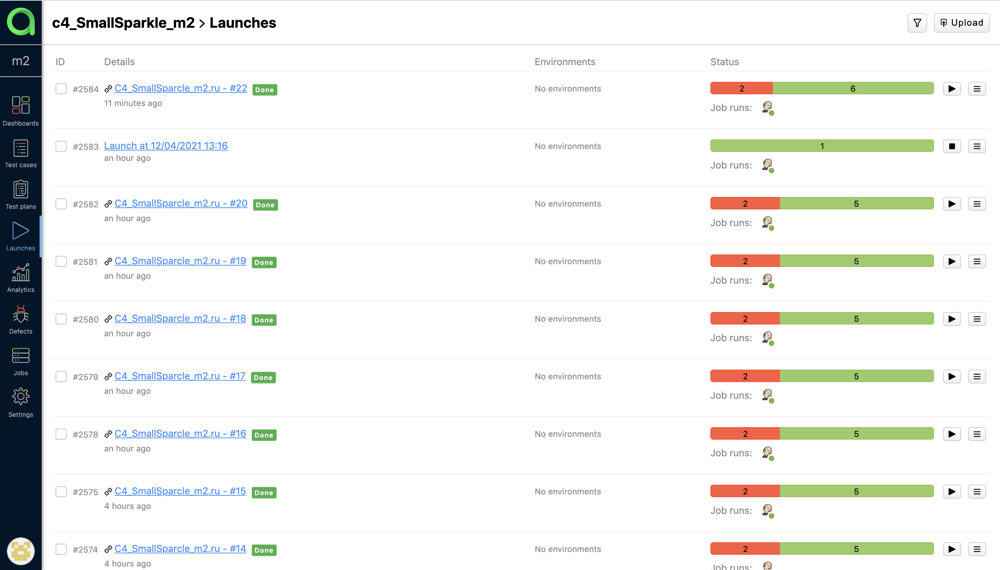

# Tests for m2.ru website

## Technology Stack
**Java, Gradle, Junit5, Selenide, Rest-Assured, Allure Reports, Selenoid, Telegram Bot.**
  

## Screenshots
#### *Jenkins - it is an open source automation server:*

 
 
 
#### *Allure Report - it is a flexible lightweight test report tool:*

 
 
 
#### *Allure TestOps - it is a TMS that allows to manage all test related stuff in one place:*

 
 
 
#### *Telegram notifications:*

 
 
 
#### *Selenoid - a lightning fast Selenium protocol implementation running browsers in Docker containers:*
