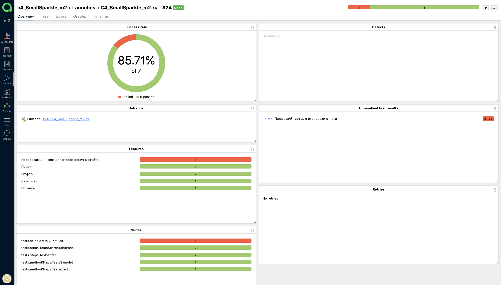

# Автотесты для [m2.ru](https://m2.ru/)
## Technology Stack
**Java, Gradle, Junit5, Selenide, Selenoid, Allure Reports, Allure TestOps, Telegram Bot.**
  
## Реализованы проверки:
**в реализации использованы разные подходы проектирования, позволяющие достичь разного представления в отчетах**

- [X] - Переход на страницу "Ипотека" с главной страницы
- [X] - Переход на страницу застройщика "Самолёт" с главной страницы
- [X] - Создание оффера неавторизованным пользователем
- [X] - Просмотр телефона продавца на карточке оффера
- [X] - Поиск на главной странице - покупка квартиры
- [X] - Поиск на главной странице - снять квартиру

## Добавлено видео о прохождении тестов

  
## Screenshots
#### *Для реализации протокола Selenium задействован Selenoid:*

 
 
 
#### *В качестве CI системы использован Jenkins*

 
 
 
#### *Для построения отчетов подключен Allure Report:*

 
 
 
#### *В качестве системы Тест Менеджмента использован Allure TestOps:*

 
 
 
#### *Настроено уведомление в Telegram:*

